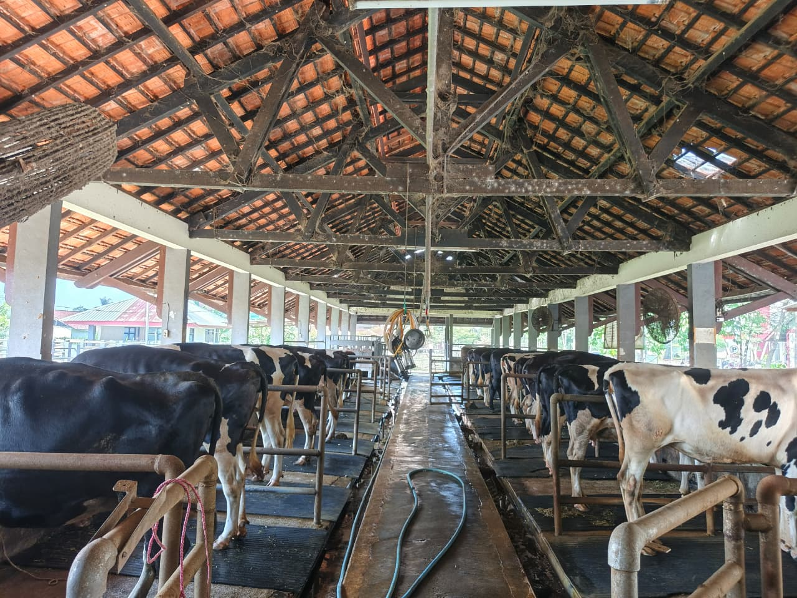

# 🐮 TEFA Feedlot & Sapi Perah Polije



> **Teaching Factory yang menghadirkan produk berkualitas tinggi dengan standar modern dan inovasi terbaik.**

Selamat datang di repositori resmi website **TEFA Feedlot & Sapi Perah Politeknik Negeri Jember**. Website ini dirancang untuk memberikan informasi mengenai profil, fasilitas, produk, dan layanan edukasi yang kami tawarkan kepada masyarakat dan mahasiswa.

---

## ✨ Fitur Utama

- **Desain Modern & Responsif**: Tampilan antarmuka yang bersih, profesional, dan ramah pengguna di berbagai perangkat (Desktop, Tablet, Mobile).
- **Informasi Lengkap**: Profil lengkap tentang TEFA, fasilitas peternakan, dan layanan yang tersedia.
- **Katalog Produk**: Showcase produk unggulan seperti Sapi Perah, Susu Segar, dan Pupuk Organik.
- **Interaktif**: Animasi halus (fade-in, zoom-in) untuk pengalaman pengguna yang menarik.
- **Kontak Mudah**: Formulir kontak terintegrasi dan informasi lokasi yang jelas.

## 🛠️ Teknologi yang Digunakan

Project ini dibangun menggunakan teknologi web modern untuk performa dan kemudahan pengembangan:

-  **HTML5**: Struktur semantik yang kuat.
-  **Tailwind CSS**: Framework CSS utility-first untuk styling yang cepat dan konsisten.
-  **JavaScript**: Interaktivitas dan logika frontend.
-  **Poppins Font**: Tipografi modern untuk keterbacaan yang baik.

## 🚀 Cara Menjalankan Project

1.  **Clone Repositori** (jika menggunakan Git):
    ```bash
    git clone https://github.com/username/repo-name.git
    ```
2.  **Buka Project**:
    Navigasi ke folder project.
3.  **Jalankan Website**:
    Cukup buka file `index.html` menggunakan browser favorit Anda (Chrome, Edge, Firefox, dll).
    - Disarankan menggunakan **Live Server** (ekstensi VS Code) atau **Laragon** untuk pengalaman pengembangan yang lebih baik.

## 📂 Struktur File

```text
/
├── assets/             # Gambar dan aset media
├── css/                # File CSS kustom (jika ada tambahan)
├── js/                 # File JavaScript
├── index.html          # Halaman Utama
├── tentang.html        # Halaman Tentang Kami
├── fasilitas.html      # Halaman Fasilitas
├── produk-layanan.html # Halaman Produk & Layanan
├── galeri.html         # Halaman Galeri Foto
├── kontak.html         # Halaman Kontak
└── README.md           # Dokumentasi Project
```

## 🤝 Kontribusi

Kontribusi sangat diterima! Jika Anda ingin meningkatkan website ini:

1.  Fork repositori ini.
2.  Buat branch fitur baru (`git checkout -b fitur-keren`).
3.  Commit perubahan Anda (`git commit -m 'Menambahkan fitur keren'`).
4.  Push ke branch (`git push origin fitur-keren`).
5.  Buat Pull Request.

## 📞 Kontak

**UPT Pengembangan Pertanian Terpadu - Politeknik Negeri Jember**

- 📍 Jl. Mastrip No. 68, Jember, Jawa Timur
- 📧 peternakan@polije.ac.id
- 📞 +62 331 333 1234

---

_Dibuat dengan ❤️ oleh Tim Error Batin_
